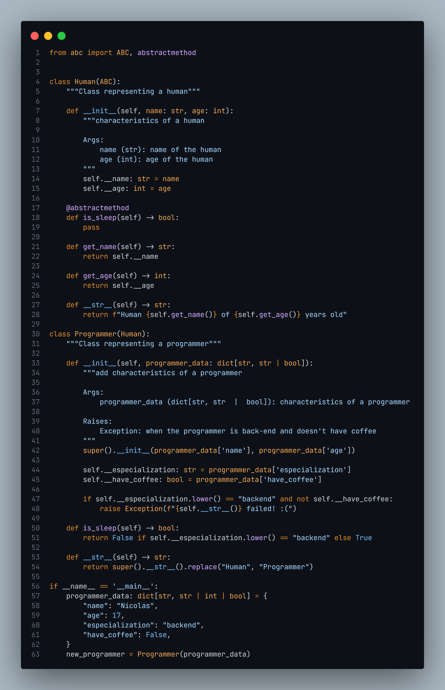

## **Oi! Me chamo Nícolas** 👋🏼👨🏼‍💻

Sou um Desenvolvedor Backend 🐱‍👤 apaixonado por resolver problemas, criar soluções inovadoras e por tornar a contribuição para o código aberto mais acessível 🚀, criando tecnologia para elevar as pessoas! Algumas tecnologias com as quais gosto de trabalhar incluem Django 🐍, Flask :hot_pepper:, FastAPI :zap:, Express e Spring Framework ☕ de Frameworks, e com Oracle Database, PostgreSQL 🐘, MySQL e Redis.

  
  

  

 
  
  
  
  
  
  
  
  
  
  
  
  
  
  

  ##
  

  
  
  
  
  

